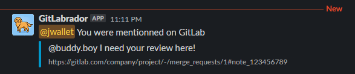

# GitLab to Slack Notifier
#### Send a private message when a user is mentionned in comments

The bot will map the `@user` tag in a GitLab comment to a user in Slack using his fullname on GitLab and format it to a business email alias  based on custom environment variables.

> `@gitlab.user` → _find the user full name_ → `User Name` → _format the full name to an email alias_ → `user.name` → _concat it with an email domain_ → `user.name@business.com` → _find the Slack user using his email_ → `U12345` → _send a notification_ → `@slackuser`



---

## Setup
1. Create a [Slack bot](https://api.slack.com/apps) using this [manifest](#using-the-manifest-when-creating-the-bot) (bot scopes section)
1. Publish this repo and serve it as a web service
   1. Clone this repo
   1. Go to [Render.com](https://render.com/)
   1. Create a free web service from this repo
1. Set the environment variables, available in `config.go`
    <details>
        <summary><b>Environment vars</b></summary>
        
    1. `PORT` (optional) Default to `3000`
    1. `SLACK_EVENT_READ_CHANNEL` (optional) It will monitor activities of a specific channel. The ID can be found by opening your Slack Workspace in the Slack web app and getting it from the URL
    1. `SLACK_BOT_OAUTH_TOKEN` The token is available in you Slack bot **Settings** → **Install App** → **Bot User OAuth Token**
    1. `USER_EMAIL_DOMAIN` Needed to format all user name to an email using this domain `@business.com`
    1. `USER_EMAIL_SPACE_REPLACER` (optional) Needed to format the user name to an email alias. It replaces spaces by another char, like "_", default to ""
    1. `GITLAB_WEBHOOK_SECRET_TOKEN` Needed to receive event from GitLab webhook, set the same phrase in GitLab Secret token than this variable
    1. `SLACK_BOT_NOTIFICATION_COLOR` (optional) color of the notification border, `#0099CC`
    1. `SLACK_BOT_NOTIFICATION_GREATINGS` Message sent by your bot to the user, the bot passes 3 arguments to your string using keyword:
        1. `{{author}}` Author of the comment
        1. `{{repository}}` Repository / project name
        1. `{{mergeRequest}}` Merge request title
        
        Set the phrase to handle one of all keywords, such as: 
        ```go
        "_{{author}}_ mentionned you on GitLab!\nProject: *{{repository}}*\nMerge request: *{{mergeRequest}}*"
        // output: 
        //    Jeff Bezos mentionned you on GitLab!
        //    Project: Amazon
        //    Merge request: AMZ-1337 Fixed bad merge
        "{{author}} mentionned you on the merge request: {{mergeRequest}}"
        // output:
        //    Jeff Bezos mentionned you on the merge request AMZ-1337 Fixed bad merged
        "_{{author|Unknown user}}_ mentionned you on GitLab"
        // output:
        //    Jeff Bezos mentionned you on GitLab
        ```

        You may want to add a fallback word if GitLab does not return a value for a certain keyword using a pipe character `|` inside the keyword. `{{author|Someone}}`: will print "_Someone_" if the author is not found.
        
    </details>


## Define the bot scopes
### Using the manifest when creating the bot
<details>
    <summary><b>Manifest</b></summary>

Change the sections wrapped in `[[brackets]]`, then use it while creating the bot **From an app manifest**:

```yaml
display_information:
  name: GitLabrador
  description: Send you a private message when you are mentioned on GitLab
  background_color: "#292961"
  long_description: "This bot send you a private message when you are mentioned on GitLab.\r

    \r

    It finds you by matching your [[business]] email to your user fullname on GitLab, which makes a direct match with your Slack ID. IF the bot cannot communicate with you, valid that your GitLab fullname matches your [[business]] email alias.\r

    \r

    Exemple: John Doe, devient john.doe@domain.com\r

    \r

    https://github.com/jwallet/gitlab-slack-notifier 🌟"
features:
  bot_user:
    display_name: GitLabrador
    always_online: false
oauth_config:
  scopes:
    bot:
      - channels:history
      - im:write
      - incoming-webhook
      - users:read
      - users:read.email
      - chat:write
settings:
  event_subscriptions:
    request_url: https://[[webservice.host.com]]/slack-events
    bot_events:
      - message.channels
  org_deploy_enabled: false
  socket_mode_enabled: false
  token_rotation_enabled: false
```

</details>

### Using the bot scopes settings
<details>
<summary><b>Manually add scopes to the bot after creation</b></summary>

Go back to your bot page, go to **OAuth & Permissions**, scroll down to **Scopes**, and select these scopes:
    
1. `im:write` to notify a user
1. `chat:write` to write as himself on Slack
1. `users:read` to fetch user info from Slack API
1. `users:read.email` to fetch user info from SLACK API
1. `channels:history` (optional, for slack events) to read the channel
1. `incoming-webhook` (optional, for slack events) only, if you used this bot to let GitLab to post to the channel with it, in Slack Integrations.
    
</details>


## The integration type is your choice...

### Slack Event integration

<details>
    <summary><b>If you prefer using Slack Event Integration</b></summary>

1. Go to the **Install app** and create a webhook URL if not done yet.
1. Copy the webhook url to your GitLab repo settings:

    > GitLab → Repo → Settings → Integrations → Slack Notifications Integration → Webhook URL
1. Configure what you will like to receive from GitLab in your Slack channel. GitLab only handle one channel at the moment ([they have an opened issue](https://gitlab.com/gitlab-org/gitlab/-/issues/12895)).
1. Go to the **Event subscriptions** and paste where you host this app `https://my.webservice.com/slack-events`
1. Then, in the same section, _Subscribe to bot events_ by adding **message.channels** `Scope channels:history` to be able to read the channel where you receive GitLab comments.
</details>
    
### Incoming Webhook integration

<details>
    <summary><b>If you prefer using the Incoming Webhook integration</b></summary>

1. Go to your GitLab repo settings
    > GitLab → Repo → Settings → Webhooks → URL
1. Copy your webservice webhook endpoint (you might not need to add the port)

    `http://my.webservice/gitlab-webhook`
1. Enter a `Secret token`, any phrase. Remember it. It will have to math the environment variable `GITLAB_WEBHOOK_SECRET_TOKEN`
1. Select to receive, only the `Comments`.
1. Save the changes, and if the server is running, hit the button **Test > Comments**.

</details>

---

### How it connects?
1. **With GitLab Slack Integration, and Slack bot Events subscription**. GitLab will post all messages to a specific channel (all kind of message that you selected in your GitLab repo settings), then the bot will be notified by Slack that new messages appear in a Slack Channel and the bot will send an event to the webservice.
1. **With GitLab Webhooks, and Slack Incoming webhook**. GitLab will send directly an event to the webservice.

Now, the service has an event and it's ready to read it to then use the Slack bot to notify the user.

### What it does with the event?
1. The service will try to find one or more mentions `@that.guy` in the comment sent by the author.

    _This Guy (this.guy) commented on merge request !1 in Project / Repo: MR_
    >    _@that.guy I need your review._

1. It will fetch from **GitLab** Open API, the user info to get its fullname. (_See the [**What's missing?**](#whats-missing), to retrieve the email directly_)
   1. It will format his fullname to a user email alias using `formatFullnameToUserEmail()` and the environment variable `USER_EMAIL_SPACE_REPLACER` to a lowercase format without diacritic, e.g.: Nathan Côté-Dumais → nathan.cote-dumais.
   1. It will then use the environment variable `USER_EMAIL_DOMAIN` to create a valid email, e.g.: nathan.cote-dumais → `nathan.cote-dumais@business.com`
1. It will fetch from Slack API the user info using his email to then extract his userID, e.g.: `UA1BCDEF`.
1. Finally, it will publish a private message notification to Slack to this user using his `userID`. The user will receive a notification from the bot itself in the Slack app section. _The message can be customized_     
    > **Jeff Bezos** mentionned you on _Amazon : AMZ-1337 Fixed bad merge_   
        `*{{author}}* mentionned you on _{{repo}}: {{mergeRequest}}_`

---

## What's missing?
Some other ways to get the user email directly from GitLab

### Self-hosted
If you are self-hosting GitLab, then this bot can be simplified by getting the user email from GitLab self-hosted API `GET:Users` with an oauth access token, instead of using a formatter `formatFullnameToUserEmail()` and environment variable `USER_EMAIL_DOMAIN` and `USER_EMAIL_SPACE_REPLACER` to generate a business user email. I did not have to implement this because my business email format is based on the user fullname and this info was available through the public API.

### User.username is the same as your business email
If you are in luck and everyone of your users have set their username `my.name` properly and they match your business email, then you could just concat this value to your domain. I was out of luck and had to fallback to the user fullname `My Name` and format it.

### Ask your users to set their Slack email as their GitLab public email
If all users set a public email on their profile, you can fetch it one-by-one by using `GET:Users/:id` or by fetching all members of a group (your business) with your private token `GET:Groups/:groupId/members?private_token=ACCESS_TOKEN`.

### Still not working for you?
Don't forget you can change the formatter that uses the user fullname in the code to make it match your business email. However, if all users are connected without a business email and on your Slack app as well, then it will be really hard for you to match the GitLab user to a Slack UserID. GitLab has some opened issues on that matter. 

#### Make the bot smarter
You can improve the bot by asking your Slack users to identify themself to the bot and connect their GitLab account to the bot so the bot can keep a Dictionary of `Dictionary<GitLabUserName, SlackUserId>` and save it to a database. Just like `GitLab` app bot does, it has a bot home page [app_home_opened](https://api.slack.com/events/app_home_opened) event subscription, it adds an entry in your GitLab profile under [Chat](https://gitlab.com/-/profile/chat_names) to have access to your GitLab profile and store it. No need to fetch all emails since the bot already knows the Slack UserID because the connect-request came from there.
